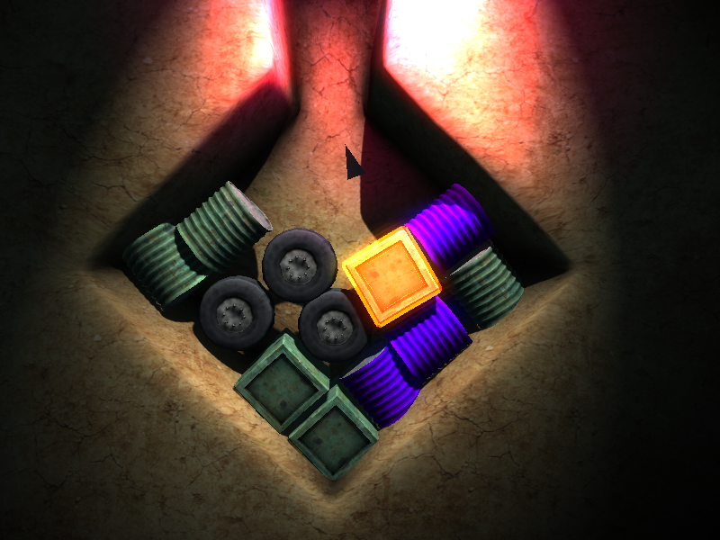
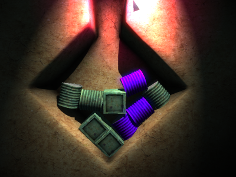
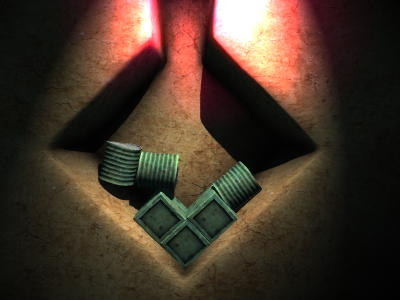
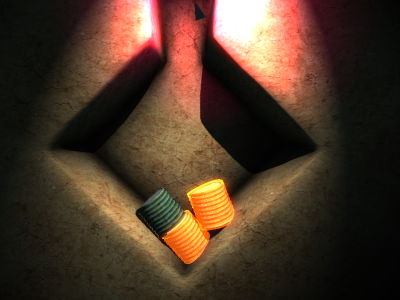
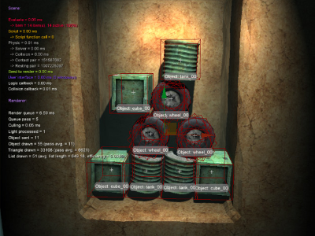

# Ludum Dare 15: Dump Caverns - Match 3 Game 

This repository contains the source code and assets for a game I created for Ludum Dare 15 (2009). The theme of the competition was "Caverns", which inspired me to create a unique "Match 3" game with the objective of cleaning up the caverns.

The game was developed using the GameStart3D engine, and was implemented in Squirrel programming language.

 

 

This game showcases a rare example of a Deferred Rendering Pipeline, a technique often used in 3D computer graphics.

## Compatibility 

Currently, the game is available for Win32 systems only.

Please navigate to the [releases section](https://github.com/astrofra/ld15-dump-caverns/releases) to download the game.

Please note that this is a project from 2009, and it might require additional steps to run properly on the latest systems. 

